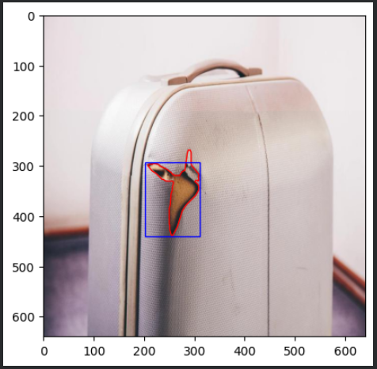
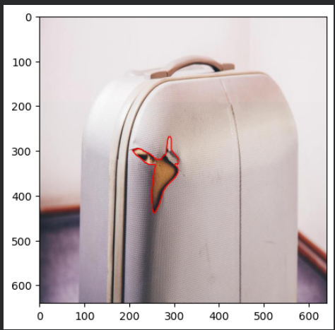
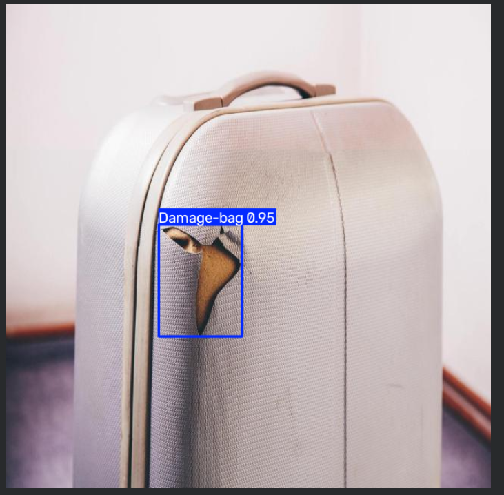

# Détection de dégâts sur valises  avec : YOLOv8

Voici mon projet personnel de vision par ordinateur : c'est un modèle qui détecte automatiquement les dégâts (déchirures, trous...) sur des valises, à partir d'une simple photo.

## Objectif

L'idée c'est de comparer une valise avant et après un vol pour repérer et localiser précisément les dommages, un peu comme le ferait un système d'assurance ou de contrôle bagages.

## Dataset

- Source : [Bag Damage Detection Dataset](https://data.mendeley.com/datasets/9k3bf6ksnd/1) (Mendeley Data / Roboflow)
- ~830 images annotées (train / valid / test)
- 1 classe : `Damage-bag`

## Modèle

- Architecture : **YOLOv8n** (Ultralytics), entraîné par transfer learning
- Fine-tuning en plusieurs étapes cumulées (50 puis +100 epochs) sur GPU (Google Colab, Tesla T4)

## Résultats

| Métrique | Score |
|---|---|
| Precision | 0.433 |
| Recall | 0.284 |
| mAP50 | 0.255 |
| mAP50-95 | 0.137 |

## Exemple de détection

Comparaison entre l'annotation de référence (contour humain) et la prédiction du modèle (rectangle) sur une image jamais vue à l'entraînement :



| Vérité | Prédiction du modèle |
|---|---|
|  |  |

## Reproduire le projet

1. Installer les dépendances avec : `pip install ultralytics
2. Lancer l'entraînement :
```python
from ultralytics import YOLO
model = YOLO("yolov8n.pt")
model.train(data="Bag Damage Detection Dataset/data.yaml", epochs=100)
```
3. Tester sur une image :
```python
model.predict(source="chemin/vers/image.jpg")
```

## Pistes d'amélioration

- Plus de données d'entraînement avec des donnees vraiment fait poour se genre d'entrainement 
- Modèle plus grand (`yolov8s`, `yolov8m`)
- Plus d'epochs
